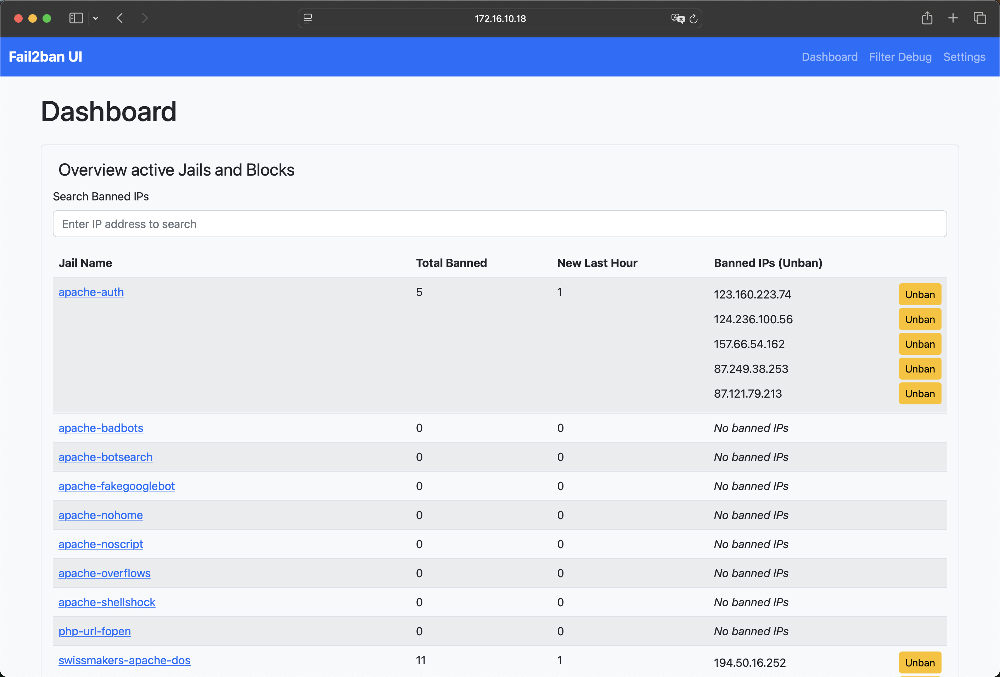
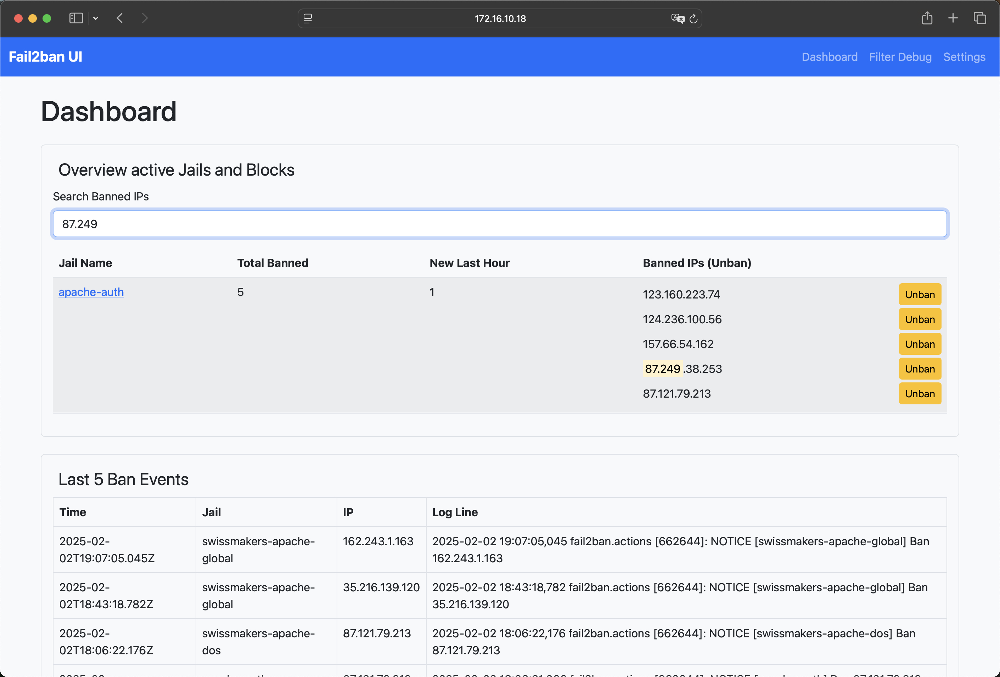
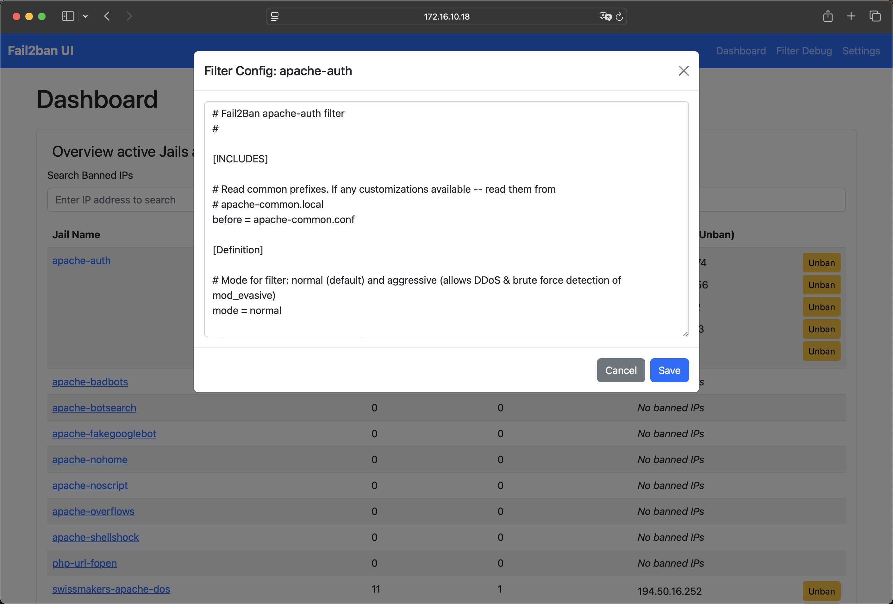

# **Fail2Ban UI**

🚀 **Fail2Ban-UI** is a Swiss-made **web-based management interface** for [Fail2Ban](https://www.fail2ban.org/).
It provides an intuitive dashboard to **monitor, configure, and manage Fail2Ban** in real time.

Developed by **[Swissmakers GmbH](https://swissmakers.ch)**.

## **✨ Features**

✅ **Real-time Dashboard**
- View **all active Fail2Ban jails** and **banned IPs** in a clean UI
- Displays **live ban events**

✅ **Ban & Unban Management**
- **Unban IPs** directly via the UI
- **Search** for banned IPs accross all active jails

✅ **Fail2Ban Configuration Management**
- **Edit & Save** active Fail2Ban jail/filter configs
- Get automatic **email alerts** for specific country-based bans
- Configure own SMTP settings for email alerts (STARTTLS only)
- Adjust default ban time, find time, and set ignore IPs
- Auto-detects changes and prompts for **reload** to apply
- Enable debug-mode for detailed module logs

✅ **Mobile-Friendly & Responsive UI / Fast**
- Optimized for **mobile & desktop**
- Powered by **Bootstrap 5**
- **Go-based backend** ensures minimal resource usage

✅ **Systemd & SELinux Support**
- **Run as a systemd service** (Standalone or Container)
- **Supports SELinux** for secure execution (also container version)

## **📸 Screenshots**
Some images from the UI in action:

| Dashboard | Search | Filter Configuration |
|-----------|-------------|--------------------|
|  |  |  |

📌 **More screenshots are found [here](./screenshots/)**

---

## **📥 Installation & Deployment**

Fail2Ban-UI can be currently deployed in **two main ways**:  
**1️⃣ Running from local source**  
**2️⃣ Running as a container**  

### **🔹 Method 1: Running from Local Source**
To install and run directly on the system:  
📌 **[Follow the basic systemd setup guide](./deployment/systemd/README.md)**  

```bash
git clone https://github.com/swissmakers/fail2ban-ui.git /opt/fail2ban-ui
cd /opt/fail2ban-ui
go build -o fail2ban-ui ./cmd/main.go
...
```

---

### **🔹 Method 2: Running as a Container**
For an easy containerized deployment:  
📌 **[Follow the basic container deployment guide](./deployment/container/README.md)**  

```bash
podman run -d \
  --name fail2ban-ui \
  --network=host \
  -v /opt/podman-fail2ban-ui:/config:Z \
  -v /etc/fail2ban:/etc/fail2ban:Z \
  -v /var/log:/var/log:ro \
  -v /var/run/fail2ban:/var/run/fail2ban \
  -v /usr/share/GeoIP:/usr/share/GeoIP:ro \
  localhost/fail2ban-ui
```

> **📌 Note:** The container can also be managed as a **systemd service**.


## **🔒 Security Considerations**
- Fail2Ban-UI requires **root privileges** to interact with Fail2Ban.  
- **Restrict access** using **firewall rules** or a **reverse proxy** with authentication.  
- Ensure that Fail2Ban logs/configs **aren't exposed publicly**.  

For **SELinux users**, apply the **Fail2Ban-UI security policies**:  
```bash
# Basic rule to allow fail2ban access the fail2ban-ui API
semodule -i fail2ban-curl-allow.pp
# Also needed for a secure container deployment
semodule -i fail2ban-container-ui.pp
semodule -i fail2ban-container-client.pp
```


## **🛠️ Troubleshooting**

### **UI not accessible?**
- Ensure **port 8080** is open:
  ```bash
  sudo firewall-cmd --add-port=8080/tcp --permanent
  sudo firewall-cmd --reload
  ```
- Check logs:
  ```bash
  journalctl -u fail2ban-ui.service -f
  ```

## **🤝 Contributing**
We welcome **pull requests** and **feature suggestions**!

1. **Fork** this repository
2. **Create** a new branch:  
   ```bash
   git checkout -b feature/my-feature
   ```
3. **Commit** your changes:  
   ```bash
   git commit -m "Add new feature"
   ```
4. **Push** to the branch:  
   ```bash
   git push origin feature/my-feature
   ```
5. **Open** a Pull Request  


## **📜 License**
Fail2Ban-UI is licensed under **GNU GENERAL PUBLIC LICENSE, Version 3**.  
See [`LICENSE`](./LICENSE) for details.  